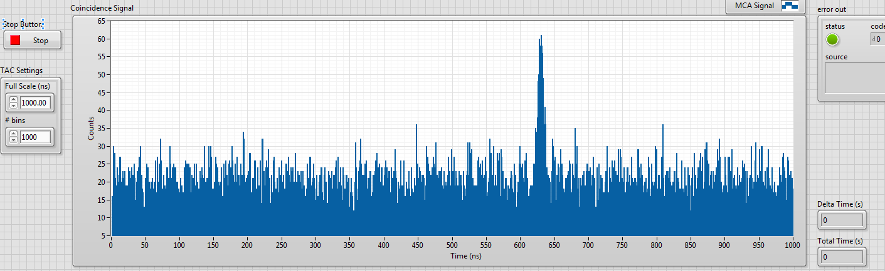
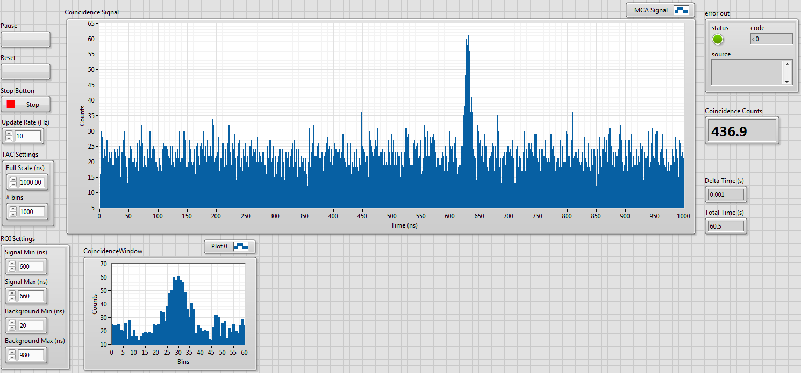

# CoincidenceMCA
A LabVIEW and M or X series data-acquisition (DAQ) card based Multi-Channel Analyser (MCA) for use in coincidence counting experiments featuring an Ortec 567 Time-To-Amplitude (TAC) converter. This is an alternative to a commercial MCA that uses one of the ADCs on board an NI DAQ card together with LabVIEW software that interfaces to the card and produces a timing spectrum in the form of a histogram.

This repository includes the MCA functional global variable (FGV) as well as two example LabVIEW programs demonstrating its usage:
1. SimpleExample_MCA_Program.vi is a bare bones program that is the minimum usable case. The data-acquisition (DAQ) card analog input hardware is set up to perform analog readings triggered by the rising edges of digital input pulses. The main loop runs continuously to check the DAQ card's first in first out buffer (FIFO) and convert any acquird voltage readings back to times as measured by the TAC. These get added to bins in a histogram to make up the continuously updated timing spectrum. Once the front panel Stop button is pressed, the analog hardware is released so it may be used by other programs, and the program stops running.

2. EventStructureBasedExample_MCA_Program.vi is a more fully featured program that makes use of most of the MCA FGV's functions. It uses an event structure to handle interactions with the front panel to show how to integrate the MCA FGV from within a more fully featured program. In this example, the user can pause and unpause data collection, reset the spectrum histogram, update TAC window settings and the number of bins to use in the histogram. The program also calculates the number of coincidence counts in real time by summing the number of counts within a region of interest and subtracting the average background counts from the surrounding region either side of the expected peak location.

## Getting Started

1. Pull the github repository to your local machine or download the zip file and unzip it. 
2. Wire up the TAC output to the chosen analog input channel.
3. Wire up the TAC Valid Conversion output to the chosen digital trigger input channel.
2. Run either of the test programs in LabVIEW.

### Prerequisites

* LabVIEW 2014 or later.
* M or X series NI DAQ card.
* TAC that features Valid Conversion digital trigger pulse output such as the Ortec 566 or 567.
* The Valid Conversion pulse's rising edge MUST take place during the peak of the TAC output pulse for the DAQ card to accurately sample the peak voltage.

## The MCA FGV's API

* **Start** Must be called at the start of the program to initialise the DAQ card's analogue input hardware. The physical channels e.g. AI0 analog input channel and PFI4 configured as digital trigger (sample clock pin) can be set before the program runs. To change these, the program must be restarted.
* **Check** Grabs any analogue readings from the DAQ cards FIFO buffer and bins them into the histogram after appropriately scaling them back to times as measured by the TAC.
* **Pause** Stops the MCA by stopping the analogue input task. Useful if the spectrometer reports a problem or if the user wishes to make changes etc. Also allows the analogue hardware to be temporarily used by another LabVIEW task, for example, to take pressure gauge readings.
* **Unpause** Restarts the analog task so that readings recommence.
* **Update Settings** Updates the number of bins in the histogram and the timing window scale. Changing these necessarily resets the MCA histogram and accrued dwell time.
* **Reset** Resets the accrued dwell time and histogram.
* **Stop** Releases the analogue task so that the analogue hardware can be used by other programs.

See the EventStructureBasedExample_MCA_Program.vi program for example use of all these functions.

## License

This project is licensed under the GPL-3.0 License - see the [LICENSE](LICENSE) file for details
